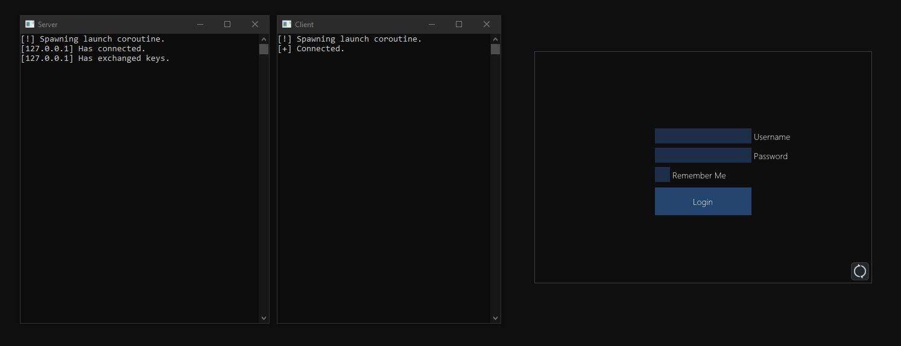
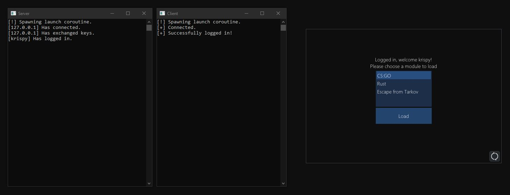
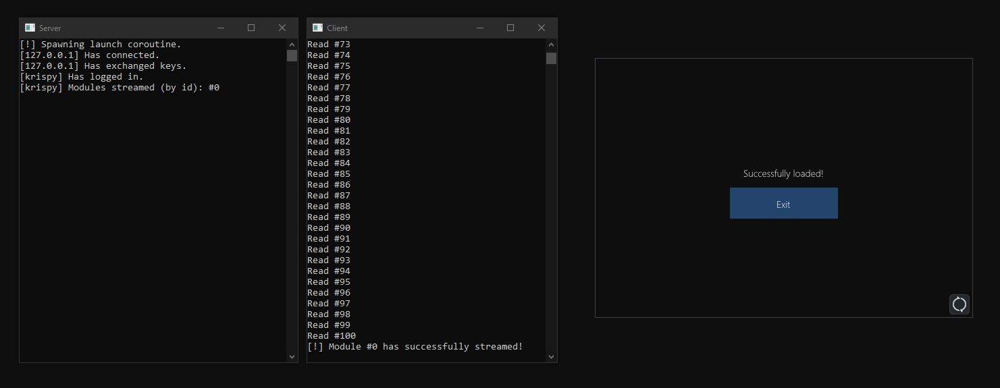

# Information
`Döner` is a project made for securing your cheat, The cheat loader includes asynchronous client and server communication made with Boost's TCP library, [Asio](https://github.com/chriskohlhoff/asio "Asio on github").
The `Döner` loader project is written in `C++20` due to the ease of development when building an asynchronous application using the new [co routines](https://en.cppreference.com/w/cpp/language/coroutines "cppreference").

This project was initially made for learning purposes and making a simple cheat loader, looking back a lot of the code could have been better, but this source should allow anyone to be able write a simple loader by using it as a reference.
A lot of the features are not finished and I will most likely not be updating it any time soon, but I hope someone is able to learn from it or possibly improve it as pull requests are welcome.

# Task-list
- [x] RSA & AES256 Key exchange
- [x] Module streaming
- [x] Client state verification handled over the server
- [x] GUI (using [ImGui](https://github.com/ocornut/imgui "ImGui on github"))
- [x] Login
- [x] Hardware ID locking
- [ ] Password hashing (crucial)
- [ ] Log files for the client and server
- [ ] Version checking and updating
- [ ] Remember Me
- [ ] Create a static library for the cryptography wrapper
- [ ] Heartbeat
- [ ] Module injection
- [ ] Client pre-loader

# Setup
### Cloning Döner
```
git clone --recursive https://github.com/krispybyte/DonerLoader.git
```

### Compiling dependencies used by Döner
<details><summary>CryptoPP library compilation</summary><br/>
1.  cd to the Dependencies/cryptopp directory.<br>
2.  git clone https://github.com/noloader/cryptopp-pem.git.<br>
3.  Add pem.h, pem_common.cpp, pem_common.h, pem_read.cpp, pem_write.cpp, x509cert.cpp and x509cert.h from the crypto-pem directory to the cryptopp submodule.<br>
4.  Launch the project and include the files you've just added, compile in x64 architecture.<br>
</details>

<details><summary>MongoDb CXX library compilation</summary><br/>
1.  cd over to the Dependencies/mongo-c-driver directory.<br>
2.  cmake -G "Visual Studio 16 2019" -DCMAKE_CXX_STANDARD=20 -DCMAKE_CXX_FLAGS="/Zc:__cplusplus" -DCMAKE_PREFIX_PATH=D:\Doner\Dependencies\mongo-c-driver -DCMAKE_INSTALL_PREFIX=D:\Doner\Dependencies-mongo-cxx-driver<br>
3.  Launch mongo-c-driver.sln, make sure the architecture is set to x64.<br>
4.  Compile the needed projects now, or all of them.<br>
5.  Launch CMake GUI, The source code path will be the directory of your mongo-cxx-driver, for example: D:\Doner\Dependencies\mongo-cxx-driver.<br>
6.  Press 'configure', set the generator and press finish.<br>
7.  You should get an error, make sure to turn BSONCXX_POLY_USE_STD on.<br>
8.  Make sure the 'Advanced' checkbox is turned on, scroll down to the bottom, you should see that bson-1.0_DIR and libbson-1.0_DIR are missing, set the libbson directory to the 'mongo-c-driver/src/libbson' directory, and the bson directory to the 'mongo-c-driver/src/libbson/bson', obviously include the full path for both.<br>
9.  You should get another error, with invalid libmongoc and mongoc directories, make the libmongoc path the 'mongo-c-driver/libmongoc' directory and the mongoc path the 'mongo-c-driver/libmongoc/mongoc' directory before pressing 'Configure' again.<br>
10.  Press 'Add Entry', name it 'CMAKE_CXX_STANDARD', set the type to string and the value to 20. Now edit the 'CMAKE_CXX_FLAGS' field and add "/Zc:__cplusplus" to it.<br>
11.  Configuration should be finished, press 'Generate' and then 'Open Project'.<br>
12.  Head to the 'mongo-cxx-driver/build' directory, launch MONGO_CXX_DRIVER.sln.<br>
13.  Make sure the architecture is set to x64, now compile 'mongocxx_shared'.<br>
14.  Done, the library will be in the 'mongo-cxx-driver/build/src/mongocxx/Release' directory by default.<br>
15.  In your actual project, make sure to also include the bson library, and both of the dynamic libraries.<br>
</details>

# Dependencies
- [Asio](https://github.com/chriskohlhoff/asio "Asio on github")
- [CryptoPP](https://github.com/weidai11/cryptopp "CryptoPP on github")
- [Json](https://github.com/nlohmann/json "Json on github")
- [MongoDB CXX](https://github.com/mongodb/mongo-cxx-driver "MongoDB CXX on github")
- [ImGui](https://github.com/ocornut/imgui "ImGui on github")
- [HardwareId](https://github.com/krispybyte/HardwareId "HardwareId on github")

# Screenshots
### Login form

### Module selection form

### Successful stream form


# Crucial Credits
- [Sariaki](https://github.com/sariaki) for inspiring me to rename the project to Döner, here's his picture which inspired me:

